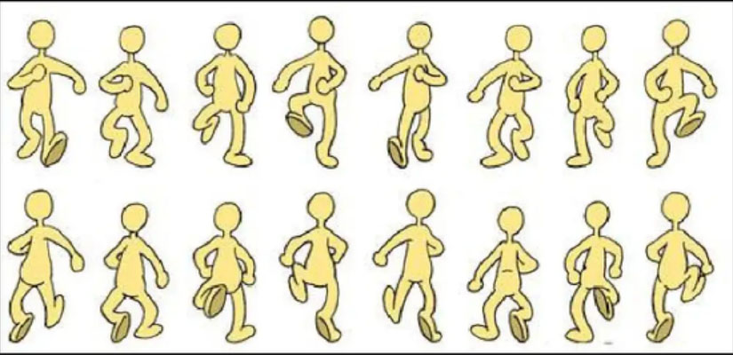
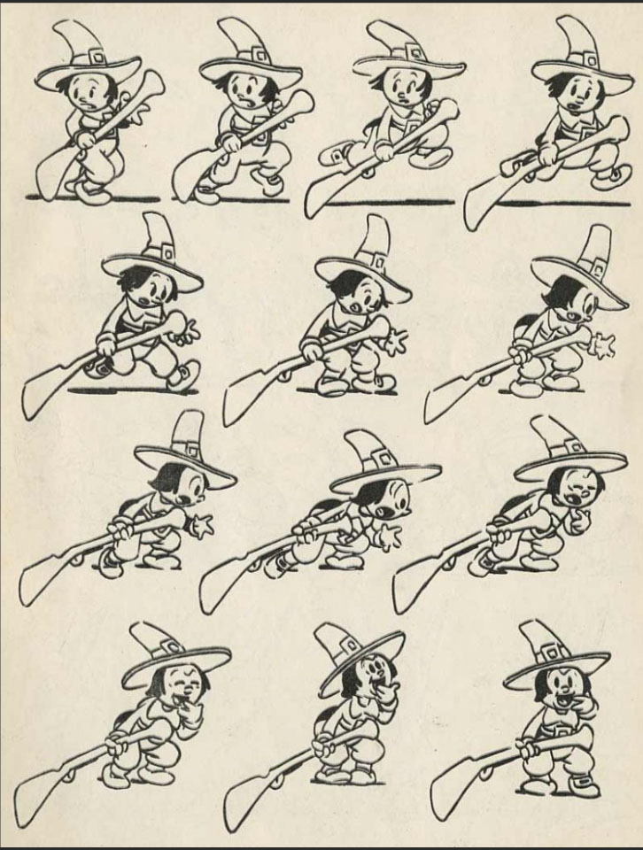

# yzha8918_IDEA9103_Week-9-Quiz

Part 1: Imaging Technique Inspiration
When I was a kid, I saw some of the earliest Chinese animation storyboards at an art exhibition. That was when I first learned that early animation was created by drawing each frame by hand, filming them one by one, and combining them into a complete animation. Ever since then, I’ve wanted to bring still images to life.

Part 2: Coding Technique Exploration
I found a tutorial on Happy Coding called Animation, which clearly explains the principles of animation and how to use variables in p5.js. It covers variable declaration, initialization, reassignment, and how to animate graphics using the draw() function. I think this tutorial will help me bring my graphics to life—for example, to make the stars move in a painting like Van Gogh’s Starry Night.

[Link Text](https://happycoding.io/tutorials/p5js/animation)